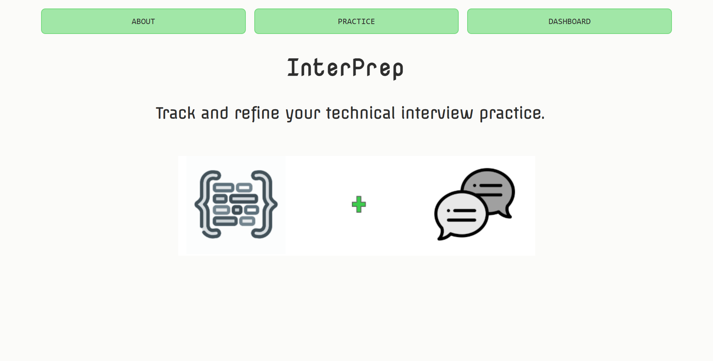

# InterPrep: Voice-Interactive AI Interview Trainer

## Overview
Many students practice LeetCode problems but struggle to explain their thought process clearly in technical interviews. 

**InterPrep** bridges this gap by providing a *voice-interactive platform* that simulates real interview conditions, helping you practice both coding and verbal communication skills.

---
## Preview


---

## Features

### Core Functionality
- **Voice-Interactive Practice** – Record explanations of your solutions using Whisper AI for automatic transcription
- **Multi-Language Code Editor** – Write solutions in Python, JavaScript, C++, Java, Go, PHP, Swift, or TypeScript
- **Problem Filtering** – Select problems by difficulty (Easy, Medium, Hard) and algorithm type
- **AI-Powered Feedback** – Get evaluated on problem identification, complexity analysis, and explanation clarity using Gemini AI
- **Progress Tracking** – Monitor your performance over time through an interactive dashboard

### Algorithm Categories
- Arrays & HashMaps
- Two Pointers & Sliding Window
- Binary Search
- Linked Lists
- Trees & Graphs
- Heaps & Priority Queues
- Dynamic Programming
- Backtracking

---

## Tech Stack

### Frontend
-  – Web application framework
-  – In-browser code editor with syntax highlighting
-   – Data visualization for progress tracking

### Backend & AI
-  – RESTful API backend
-  (via [**faster-whisper**](https://github.com/SYSTRAN/faster-whisper)) – Automatic speech recognition for transcription
-  – LLM-powered evaluation and feedback generation
-   – Data processing and analysis

### Machine Learning
-  – Deep learning framework
-  – NLP model support
-  – ML utilities

---

## Installation & Setup

#### 1. Clone the repository
```bash
git clone https://github.com/ishratarshad/InterPrep.git
cd InterPrep
```

#### 2. Set up virtual environment
```bash
python -m venv venv
# Windows
venv\Scripts\activate
# macOS/Linux
source venv/bin/activate
```

#### 3. Install dependencies
```bash
pip install -r requirements.txt
```

#### 4. Configure environment variables
Create a `.env` file in the project root:
```env
GEMINI_API_KEY=your_gemini_api_key_here
```

#### 5. Run the application
```bash
streamlit run app.py
```

The app will open in your browser at `http://localhost:8501`

---

## Project Structure

```
InterPrep/
├── app.py                     # Main application entry point
├── pages/
│   ├── about.py               # Landing page with project info
│   ├── select_criteria.py     # Problem filter selection
│   ├── interview.py           # Code editor + audio recording
│   ├── results.py             # Evaluation and feedback display
│   └── dashboard.py           # Progress tracking and metrics
├── backend/
│   ├── api.py                 # FastAPI endpoints for AI analysis
│   ├── transcription.py       # Whisper integration
│   └── leetcode_manager.py    # Problem filtering logic
├── evaluation/                # Rubric and grading documentation
├── code/                      # stores user's code solution; generated upon run-through of code
├── audio/                     # stores user's audio clip; generated upon run-through of code
├── transcript/                # stores user's audio transcript; generated upon run-through of code
├── shared/
│   └── navbar.py              # Navigation component
├── .env                       # stores environment variables
├── globals.py                 # Shared styles and constants
└── requirements.txt
```

---

## How It Works

### 1. Select Criteria (Practice)
Choose your criteria for problem difficulty and algorithm types to get a curated question

### 2. Practice Interview
- Write your solution in the integrated code editor
- Record your verbal explanation answering a follow-up question
- Audio is automatically transcribed using Whisper AI

### 3. Get Feedback
Receive AI-generated evaluation on:
- **Problem Identification (35 pts)** – Pattern recognition, understanding, approach selection
- **Complexity Analysis (35 pts)** – Time/space complexity correctness
- **Clarity of Explanation (30 pts)** – Structure, technical communication, completeness

### 4. Track Progress (Dashboard)
Monitor your improvement over time through the dashboard


---

## Evaluation Rubric

The system evaluates explanations on a **100-point scale**:

| Score Range | Level | Description |
|------------|-------|-------------|
| 90-100 | Excellent | Outstanding performance, fully meets expectations |
| 75-89 | Good | Slight improvements possible |
| 60-74 | Satisfactory | Acceptable with some gaps |
| 40-59 | Needs Improvement | Significant issues to address |
| < 40 | Poor | Fails to meet basic criteria |

See [evaluation/rubric.md](evaluation/rubric.md) for detailed scoring criteria.

---

## Dataset

**LeetCode Problem Dataset** from [Kaggle](https://www.kaggle.com/datasets/gzipchrist/leetcode-problem-dataset/data)
- 1800+ curated problems across 10+ categories
- Includes problem statements, difficulty levels, and metadata

---

## Future Enhancements

- [ ] Code execution and runtime validation
- [ ] Multi-turn dialogues with adaptive hints
- [ ] Retrieval of similar problems using embeddings
- [ ] Account and progress tracking
- [ ] Social features (leaderboards, peer comparison)


---
### Expected Impact
Receive AI-generated evaluation on:
- Communication skill development
- Provides a structured and adaptive roadmap for technical interview preparation
- Improves both problem-solving performance and explanation clarity
- Helps students prepare more effectively and gain confidence in real interviews


## License

This project is open source and available under the MIT License.

---
